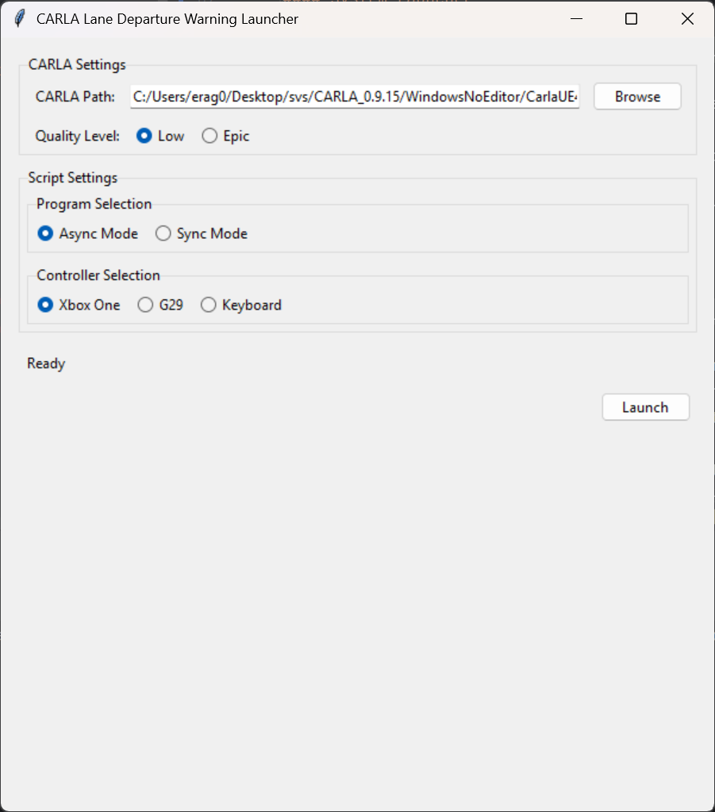
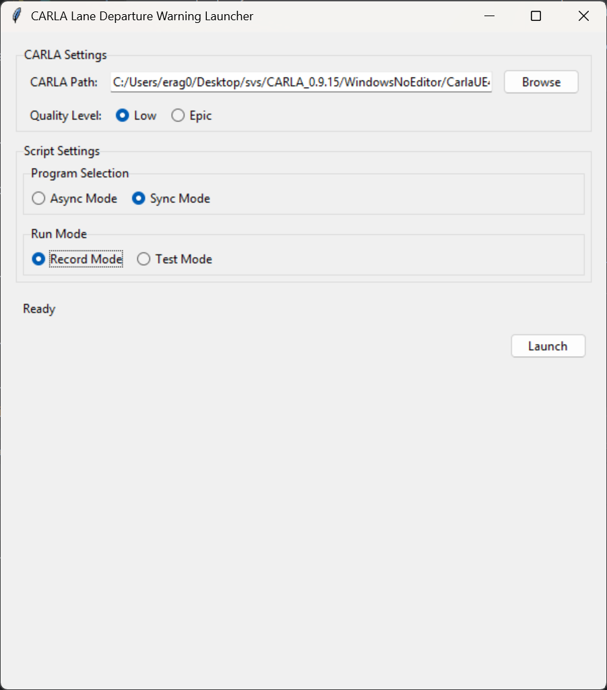
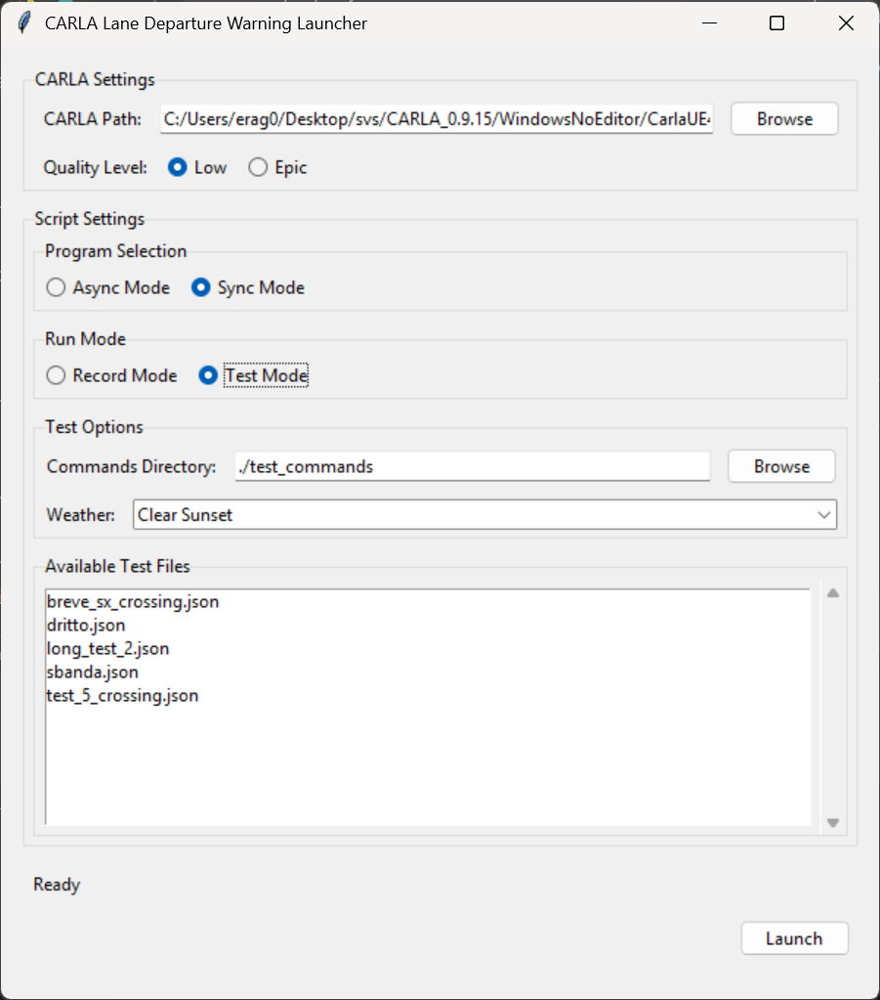

## Deployment

This section outlines the deployment process for the lane detection system, covering environment setup, configuration, and execution procedures.

### System Requirements

#### Hardware Requirements
* NVIDIA GPU (recommended for optimal YOLOP model performance)
* Minimum 8GB RAM
* 20GB free disk space

#### Software Requirements
* Windows 10/11 or Linux (Ubuntu 18.04+)
* Python 3.7
* CARLA 0.9.15 simulator
* HiveMQ account (for MQTT-based event publishing)

### Environment Setup

```bash
# Create a new conda environment
conda env create -f environment.yml

conda activate carla-env
```

### Environment Configuration

1. Create a `.env` file in the project root with your HiveMQ credentials:

   ```
   HIVE_MQ_USERNAME=your_username
   HIVE_MQ_PASSWORD=your_password
   ```

2. Ensure CARLA simulator is correctly installed.

### Deployment Structure

```
project_root/
├── analysis/                          # Analysis modules
├── camera_lanes_analysis_async.py     # Main simulation script
├── camera_lanes_analysis_sync.py      # Synchronous simulation script suite for testing and recording
├── data/                              # Model and data storage
│   └── weights/                       # YOLOP model weights
│       └── yolopv2.pt                 # YOLOP model file
├── environment.yml                    # Conda environment configuration
├── launcher.py                        # Main launcher script
├── log/                               # Log storage
│   ├── tracked/                       # Performance logs
│   └── untracked/                     # Test result logs
├── test_commands/                     # Test scenario files
│   └── recorded/                      # Recorded control sequences
├── utils/                             # Utility modules
│   ├── YOLOPModel.py                  # Lane detection model
│   ├── carla.py                       # CARLA helpers
│   ├── DetectionLogger.py             # Detection event logging
│   ├── image_cropper.py               # Image preprocessing
│   └── utils.py                       # General utility functions for YOLOPv2
└── wheel_config.ini                   # Steering wheel configuration
```

### Running the System

This section describes how to run the lane detection system, including the launcher mechanism and the two operational modes: asynchronous (for normal usage) and synchronous (for testing).

#### System Launcher

Our system includes a launcher component (`launcher.py`) that simplifies the startup process by coordinating the launch of both the CARLA simulator and our lane detection application. The launcher handles:

1. Starting the CARLA simulator with appropriate parameters
2. Waiting for CARLA to fully initialize
3. Launching the selected lane detection script (either asynchronous or synchronous mode)

The launcher ensures proper sequencing and configuration, reducing errors during startup and making the system more accessible to users without extensive technical knowledge.

#### Asynchronous Mode

The asynchronous mode (`camera_lanes_analysis_async.py`) is our primary operational script for real-time lane detection. This script:

- Provides real-time lane detection with minimal latency
- Supports multiple controller inputs (G29 Steering wheel, Xbox One controller, Keyboard)
- Displays real-time visualization of lane detection results
- Connects to the CARLA simulator and manages all vehicle controls
- Processes camera feeds using the YOLOP model for lane detection
- Compares YOLOP detection with CARLA's built-in lane invasion detection
- Sends notifications through MQTT for integration with other systems

This mode is optimized for real-world performance and offers the most responsive experience when operating the system manually.

.Launcher in asynchronous mode


#### Synchronous Mode (Test Suite)

The synchronous mode (`camera_lanes_analysis_sync.py`) is specifically designed for testing and validation. Key features include:

- Fixed framerate execution for consistent, reproducible results
- Recording capability that saves control inputs (throttle, brake, steering) to JSON files
- Playback functionality to replay recorded driving sessions exactly
- Detailed statistics collection for comparing detection methods
- Support for different weather conditions through command-line options
- Logging of test results for later analysis


.Launcher in synchronous mode for recording


.Launcher in synchronous mode for playback


### Troubleshooting

#### Common Issues

1. **CARLA Connection Failure**:  
   Ensure CARLA server is running on the specified host and port.

2. **Model Initialization Error**:  
   Check that YOLOP model files are correctly placed in the expected directory.

3. **Controller Not Detected**:  
   Verify controller is connected and correctly configured in `wheel_config.ini`.

4. **HiveMQ Connection Failure**:  
   Confirm credentials in `.env` file and network connectivity to HiveMQ cloud.

#### Log Files

Examine logs in the `log/` directory for detailed error information:

* `log/tracked/frame_performance_log.txt`: Processing performance metrics
* `log/untracked/test_log.txt`: Test results and statistics