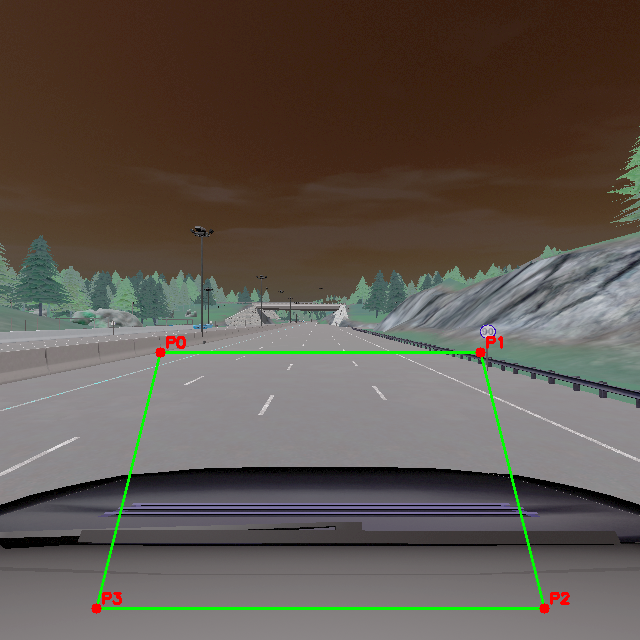

== Design Of Proposed Solution

=== Sensors used
For this lane departure warning system, we use a RGB camera as the primary sensing device. The camera captures real-time images of the roadway ahead of the vehicle with a resolution of 640x640 pixels. This resolution provides sufficient detail for lane detection while remaining computationally efficient for real-time processing.

The camera is mounted on the rearview mirror, a location that offers several advantages:

* Unobstructed forward view of the road
* Minimal intrusion into the driver's field of vision
* Standard mounting position in modern commercial vehicles

The exact positioning coordinates are (x=0.6, y=0.0, z=1.41) with a pitch of 0 degrees. This precise placement ensures optimal coverage of the road surface and minimizes distortion while maintaining a practical implementation suitable for mass-production vehicles.

=== Camera Positioning

image::../resources/png/camera_inside_view.png[View of Camera Inside the Car, width=600]

=== Picture Preprocessing
Trapezoid Cut + Change of Perspective

image::../resources/png/trapezoid_warped.png[Perspective Change Visualization]

=== Picture Processing
Talk about what YOLOP does, and result had, explore the tech later in the section for technologies
Later of our Computer Vision Algorithm

=== Technologies used
Technolegies used (Here talk about YOLOP)

