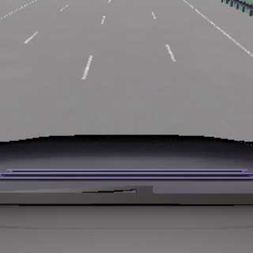

== Design Of Proposed Solution

=== Sensors used
For this lane departure warning system, we use a RGB camera as the primary sensing device. The camera captures real-time images of the roadway ahead of the vehicle with a resolution of 640x640 pixels. This resolution provides sufficient detail for lane detection while remaining computationally efficient for real-time processing.

==== Camera Positioning

The camera is mounted on the rearview mirror, a location that offers several advantages:

* Unobstructed forward view of the road
* Minimal intrusion into the driver's field of vision
* Standard mounting position in modern commercial vehicles

The exact positioning coordinates are (x=0.6, y=0.0, z=1.41) with a pitch of 0 degrees. This precise placement ensures optimal coverage of the road surface and minimizes distortion while maintaining a practical implementation suitable for mass-production vehicles.

.Camera Positioning from Multiple Angles

.Camera View

=== Picture Preprocessing

Every frame captured from the RGB camera undergoes several critical preprocessing steps before being fed into the lane detection system:

==== Region of Interest Selection
First, the system defines a trapezoid-shaped region of interest (ROI) on the raw camera image:

[source,python]
----
src_points = np.float32([
    [width * 0.25, height * 0.55],  # Top-left
    [width * 0.75, height * 0.55],  # Top-right
    [width * 0.85, height * 0.95],  # Bottom-right
    [width * 0.15, height * 0.95]   # Bottom-left
])
----

This trapezoid specifically targets the road area ahead of the vehicle, eliminating irrelevant portions of the image such as the sky, roadside objects, and the vehicle's hood that could interfere with lane detection.

image::../resources/png/trapezoid_visualization.png[Trapezoid Cut Visualization]

==== Perspective Transformation
Next, a bird's-eye view transformation is applied to the selected region using OpenCV's perspective transformation functions:

[source,python]
----
# Get the perspective transformation matrix
M = cv2.getPerspectiveTransform(src_points, dst_points)

# Apply the perspective transformation
warped = cv2.warpPerspective(image_to_analyze, M, (define_crop_size, define_crop_size))
----

This transformation:

- Removes perspective distortion where distant lane lines appear to converge
- Creates a uniform representation where lane width is consistent regardless of distance
- Makes subsequent lane detection calculations more straightforward by converting to a 2D plane

.Perspective Change Visualization

==== Format Conversion for Neural Network
Finally, the image is converted from HWC (Height, Width, Channel) format to CHW (Channel, Height, Width) format required by our PyTorch-based neural network:

[source,python]
----
warped_chw = warped.transpose(2, 0, 1)  # HWC to CHW
----

This standardized preprocessing pipeline ensures that our lane detection system receives consistent, optimized input regardless of lighting conditions or road characteristics, improving both the accuracy and reliability of the system.

=== Picture Processing

The image processing pipeline through YOLOPv2 involves several sophisticated steps to detect lane markings and potential lane departures:

==== Neural Network Inference
Each captured frame from the vehicle-mounted camera undergoes analysis through a YOLOPv2 (You Only Look Once Panoptic) model:

[source,python]
----
def analyzeImage(image):
    # Convert image format for neural network
    img0 = image.transpose(1, 2, 0)  # CHW to HWC
    img = letterbox(img0, new_shape=img0.shape[:2])[0]
    img = img[:, :, ::-1].transpose(2, 0, 1)  # BGR to RGB, HWC to CHW

    # Normalize and prepare tensor
    img = torch.from_numpy(np.ascontiguousarray(img)).to(device)
    img = img.half() if half else img.float()
    img /= 255.0  # Normalize to 0.0-1.0 range
----

==== Multi-Task Output Processing
YOLOPv2 simultaneously produces three critical outputs from a single forward pass:

1. Object detection results (`pred`) - identifying traffic participants
2. Drivable area segmentation (`seg`) - determining where the vehicle can safely travel
3. Lane line segmentation (`ll`) - precisely identifying lane markings

==== Lane Detection and Analysis
The system processes segmentation masks to isolate lane markings:

[source,python]
----
# Extract and resize segmentation masks
da_seg_mask = driving_area_mask(seg)
ll_seg_mask = lane_line_mask(ll)

# Resize masks to match original image dimensions
da_seg_mask_resized = cv2.resize(da_seg_mask, img0.shape[:2][::-1])
ll_seg_mask_resized = cv2.resize(ll_seg_mask, img0.shape[:2][::-1])
----

==== Bounding Box Filtering
Lane markings are identified through contour analysis and filtered based on specific parameters:

[source,python]
----
# Find contours of lane lines
contours, _ = cv2.findContours(red_lane_mask, cv2.RETR_EXTERNAL, cv2.CHAIN_APPROX_SIMPLE)

# Filter boxes based on size and orientation
MIN_BOX_WIDTH = 40
MIN_BOX_HEIGHT = 40
ORIENTATION_THRESHOLD = 4.0  # Avoid horizontal boxes

red_boxes = []
for cnt in contours:
    x, y, w, h = cv2.boundingRect(cnt)
    if w > MIN_BOX_WIDTH and h > MIN_BOX_HEIGHT:
        aspect_ratio = w / h
        if aspect_ratio < ORIENTATION_THRESHOLD:
            red_boxes.append((x, y, w, h))
----

This filtering ensures that only valid lane markings are considered, eliminating noise and irrelevant shapes.

==== Nested Box Elimination
The system removes redundant or nested boxes to prevent double-counting of lane markings:

[source,python]
----
red_boxes = filter_nested_boxes(red_boxes, iou_threshold=0.8)
----

==== Lane Crossing Detection
Lane departure is determined through geometric analysis of identified lane markings:

[source,python]
----
if red_boxes:
    # Calculate lane center
    leftmost_red = min([x for x, y, w, h in red_boxes])
    rightmost_red = max([x + w for x, y, w, h in red_boxes])
    lane_center_x = (leftmost_red + rightmost_red) // 2
    img_center_x = combined.shape[1] // 2

    # Measure distance from center
    center_distance = lane_center_x - img_center_x

    # Apply thresholds for different crossing states
    CENTERED_THRESHOLD = 30
    CROSSING_THRESHOLD = 53

    if len(red_boxes) == 1:  # Single box scenario
        alignment_status = "CROSSING: SBX"
        crossing = True
    else:
        if abs(center_distance) < CENTERED_THRESHOLD:
            alignment_status = "CENTERED"
        elif abs(center_distance) < CROSSING_THRESHOLD:
            alignment_status = "CROSSING: SL/SR"
            crossing = True
        else:
            alignment_status = "CROSSING: LEFT/RIGHT"
            crossing = True
----

The system classifies the vehicle's position relative to the lanes into several states:

* **CENTERED** - Vehicle is properly aligned within lane
* **CROSSING: SL/SR** - Vehicle is slightly crossing to left or right
* **CROSSING: LEFT/RIGHT** - Vehicle is significantly crossing lane boundaries
* **CROSSING: SBX** - Single box detection indicating probable crossing

This detailed analysis enables the lane departure warning system to accurately detect unintentional lane departures and alert the driver in real-time, enhancing road safety.

=== Technologies Used

In our project, we employed YOLOPv2, an advanced multi-task learning network designed for panoptic driving perception. This model efficiently integrates three critical tasks in autonomous driving: traffic object detection, drivable area segmentation, and lane detection. By utilizing a shared encoder and task-specific decoders, YOLOPv2 achieves high accuracy and speed, making it suitable for real-time applications.

The architecture of YOLOPv2 comprises a shared encoder and three task-specific decoders:

- **Shared Encoder**: YOLOPv2 adopts the Extended Efficient Layer Aggregation Networks (E-ELAN) as its backbone for feature extraction. E-ELAN employs group convolution, enabling different layers to learn more diverse features, thereby enhancing both efficiency and performance.

- **Object Detection Decoder**: This decoder implements an anchor-based multi-scale detection scheme. Features from the Path Aggregation Network (PAN) and Feature Pyramid Network (FPN) are combined to fuse semantic information with local features, facilitating detection on multi-scale fused feature maps. Each grid in the feature map is assigned multiple anchors of different aspect ratios, with the detection head predicting the position offsets, scaled height and width, as well as the probability and confidence for each class.

- **Drivable Area Segmentation Decoder**: Unlike previous models where features for segmentation tasks are derived from the last layer of the neck, YOLOPv2 connects the drivable area segmentation head prior to the FPN module. This approach utilizes features from less deep layers, which are more suitable for this task. To compensate for potential information loss, an additional upsampling layer is applied in the decoder stage.

- **Lane Detection Decoder**: This decoder focuses on identifying lane markings, which is crucial for lane-keeping and lane-changing maneuvers in autonomous driving systems. It branches out from the FPN layer to extract features from deeper levels. Given that lane markings are often slender and challenging to detect, deconvolution is applied in the decoder stage to improve performance.

==== Technical Specifications

YOLOPv2 operates with remarkable efficiency while maintaining high accuracy:

- *Input Resolution*: 640×640 pixels
- *Inference Speed*: 30+ FPS on consumer-grade GPU hardware
- *Model Size*: ~40MB, enabling deployment on embedded automotive systems
- *Lane Line Detection*: Accuracy of 87.3% and IoU of 27.2%
- *Half-precision Support*: FP16 computation for accelerated inference

==== Key Advantages for Lane Departure Systems

YOLOPv2 offers several critical advantages for lane departure warning applications:

1. *Unified Processing*: By handling object detection and lane segmentation simultaneously, the system gains contextual awareness of the entire driving scene
2. *Low Latency*: Critical for time-sensitive warning systems, with end-to-end processing under 33ms
3. *Resilience to Conditions*: Robust performance across varying lighting, weather, and road conditions
4. *Memory Efficiency*: Shared feature extraction reduces computational overhead
5. *Integration Potential*: The multi-task architecture allows expansion to additional ADAS functions with minimal additional hardware

The official implementation of YOLOPv2 is available on GitHub:

link:https://github.com/CAIC-AD/YOLOPv2[YOLOPv2 GitHub Repository]

=== Event Publishing in MQTT Broker

The Lane Departure Warning system utilizes MQTT (Message Queuing Telemetry Transport) protocol to publish events when lane departures are detected. This enables real-time communication between different components of the autonomous driving system and facilitates integration with warning systems, data logging services, and monitoring applications.

==== HiveMQ Cloud Platform

For this project, we use HiveMQ Cloud as our MQTT broker service, which provides:

* *Secure Communication*: TLS/SSL encrypted connections with certificate validation
* *High Availability*: 99.9% uptime SLA for reliable message delivery
* *Scalability*: Support for thousands of concurrent connections
* *Compliance*: MQTT 3.1.1 and MQTT 5.0 protocol support
* *Global Accessibility*: Low-latency access from anywhere in the world

==== MQTT Client Configuration

The system establishes a secure connection to the HiveMQ Cloud broker using the following configuration:

[source,python]
----
def setup_mqtt_client():
    # Retrieve the username and password from local storage or environment variables.
    # These credentials are stored locally and are not pushed to GitHub.
    mqtt_client = mqtt.Client(mqtt.CallbackAPIVersion.VERSION2, client_id="carla_lane_detector")
    mqtt_client.tls_set(cert_reqs=ssl.CERT_REQUIRED, tls_version=ssl.PROTOCOL_TLS)
    mqtt_client.username_pw_set(username, password)
    mqtt_client.connect("hivemqconnectionstring.s1.eu.hivemq.cloud", 8883)
    mqtt_client.loop_start()
    return mqtt_client
----

==== Event Structure and Publishing

When the system detects a lane departure, it constructs and publishes a structured JSON message:

[source,python]
----
mqtt_message = {
    "event": "lane_crossing",
    "system": "YOLOP",
    "crossing": crossing,
    "timestamp": datetime.now().isoformat(),
}

mqtt_client.publish(
    topic="carla/lane_detection",
    payload=json.dumps(mqtt_message),
    qos=1
)
----

The message contains:

* *Event Type*: The specific event being reported ("lane_crossing")
* *Detection System*: The algorithm that detected the crossing ("YOLOP")
* *Crossing Status*: Boolean indication of lane boundary warning
* *Timestamp*: ISO-formatted date and time for event sequencing and correlation

Messages are published to the topic `carla/lane_detection` with Quality of Service (QoS) level 1, ensuring at-least-once delivery guarantee.

==== Benefits for Autonomous Driving Integration

The MQTT-based event publishing architecture offers several advantages for our lane departure warning system:

1. *Real-time Alerting*: Sub-second notification of critical safety events
2. *System Decoupling*: Detection and response systems can evolve independently
3. *Distributed Processing*: Events can trigger responses across multiple vehicle systems
4. *Data Persistence*: Integration with long-term storage for performance analysis
5. *Standards Compliance*: Following industry standards facilitates integration with other systems

This design allows for flexible extension and integration with various components of autonomous driving systems while maintaining reliable communication channels for safety-critical information.

